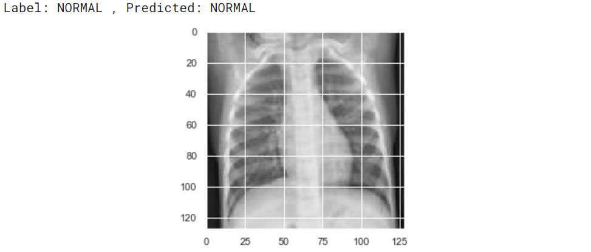
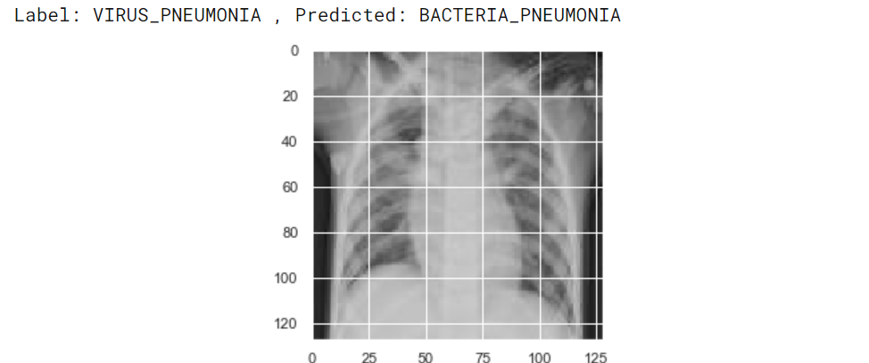
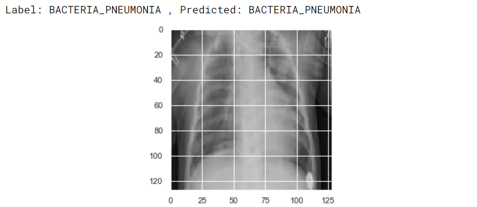
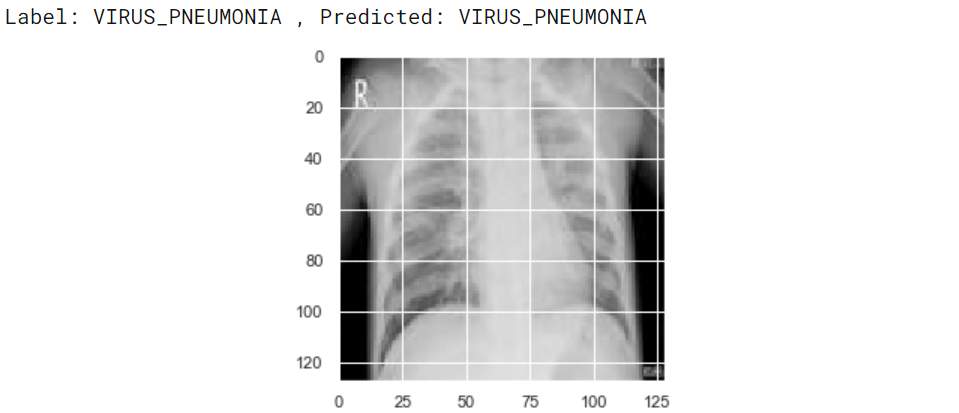

# Predicting Pneumonia Using Human Chest X-ray

This task uses data from kaggle dataset [Chest X-Ray Images (Pneumonia)](https://www.kaggle.com/paultimothymooney/chest-xray-pneumonia)
for the task of predicting Pneumonia using Human Chest X-rays.

Checkout the [medium article](https://medium.com/@devin.18/predicting-the-probability-of-pneumonia-using-chest-x-rays-and-cnns-67457529cf28) as well

This task uses a ResNet Architecture for the classifier model and a pytorch backend.

Few of the model Predictions are shown below

